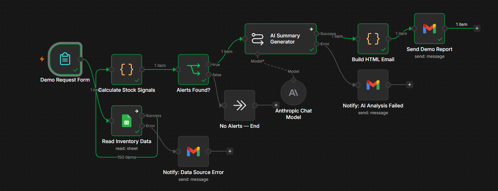
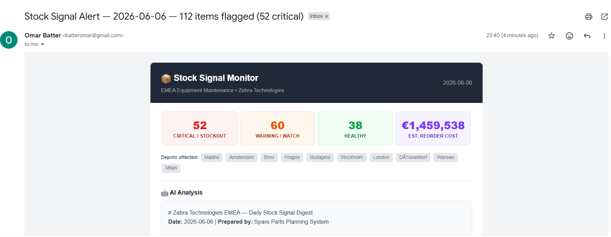

# Stock Signal Monitor

AI-powered spare parts inventory monitoring for EMEA depot operations. Reads 150+ parts across 10 European depots, calculates reorder signals, generates an AI analysis with Claude, and delivers a styled HTML email digest.

Built with [n8n](https://n8n.io) · [Claude AI](https://anthropic.com) · Google Sheets · Gmail

## Live Demo

Try it yourself — enter your email and receive a sample stock signal report in ~30 seconds:
https://omar-ai0.app.n8n.cloud/form/0b2a4498-27ac-49bd-baad-689b33190d2f

The screenshot above shows the production workflow, which runs on a daily 8 AM schedule. The live demo uses a form trigger so anyone can experience the output without setup.

---

## The Problem
Depot planning teams responsible for repair operations track hundreds of spare parts across multiple warehouse locations. Each part has its own reorder threshold, daily consumption rate, and supplier lead time. Manually cross-referencing these variables every morning to catch stockouts before they halt repairs is repetitive, error-prone, and easy to miss — especially when a single planner is responsible for 10+ depots across different countries.

## The Solution
This workflow automates the entire daily check. Every weekday at 8 AM CET, it:

Reads inventory data from a Google Sheet containing 150 parts across 10 EMEA depots (Brno, Prague, Düsseldorf, Madrid, Amsterdam, Warsaw, Milan, Budapest, London, Stockholm)
Calculates stock signals for every part — days of stock remaining, whether current stock will survive the supplier lead time, a suggested reorder quantity, and the estimated cost
Classifies each part into severity tiers: STOCKOUT → CRITICAL → WARNING → WATCH → OK
Generates an AI summary using Claude Sonnet 4.6 — a plain-language executive briefing that highlights the most urgent items and recommends specific actions
Builds a styled HTML email with KPI cards, color-coded severity tables, depot tags, and the AI analysis embedded
Sends the digest to the planning team via Gmail

The result: a planner opens their inbox at 8:05 AM and knows exactly which parts need ordering, at which depots, at what cost — without touching a spreadsheet.

## Signal Logic

| Severity | Trigger |
|----------|---------|
| STOCKOUT | Stock = 0 |
| CRITICAL | Below threshold AND won't last through supplier lead time |
| WARNING | Below threshold, but stock covers lead time |
| WATCH | Above threshold but within 1.5× lead time of depletion |
| OK | Healthy |

# Suggested order quantity formula:
order_qty = reorder_threshold - current_stock + (daily_consumption × supplier_lead_time_days)

This would ensure the order brings stock back above the minimum threshold while also covering demand during the lead time waiting period.

## Architecture
Daily 8AM Trigger (weekdays, Europe/Prague timezone)
       │
       ▼
Read Inventory Data (Google Sheets — 150 rows, 10 depots)
       │                    │
       │               [on error]
       │                    ▼
       │              Notify: Data Source Error (Gmail → admin)
       ▼
Calculate Stock Signals (JavaScript)
 - Parses all inventory rows
 - Computes days-of-stock-left, lead time coverage, reorder qty, cost
 - Assigns severity: STOCKOUT / CRITICAL / WARNING / WATCH / OK
 - Sorts alerts by severity, builds summary object
       │
       ▼
Alerts Found? (IF node — alerts_count > 0)
       │                    │
      YES                   NO
       │                    ▼
       │              No Alerts — End
       ▼
AI Summary Generator (Claude Sonnet 4.6, temp 0.3)
 - Receives top alerts as structured JSON
 - Writes executive summary with specific actions
       │                    │
       │               [on error]
       │                    ▼
       │              Notify: AI Analysis Failed (Gmail → admin with raw data fallback)
       ▼
Build HTML Email (JavaScript)
 - Renders KPI cards, depot tags, AI summary box
 - Builds critical actions table (red) and watch list table (amber)
 - Outputs complete HTML email ready for Gmail
       │
       ▼
Send Report Email (Gmail — HTML)

## Error Handling 

Both the Google Sheets read and the AI generation nodes have continueErrorOutput configured. If the spreadsheet can't be read, an error notification is sent to the admin. If the AI summary fails, a fallback email containing the raw alert data is sent instead — so the planning team can still act even when the AI layer is down

## Email Output
The daily email includes:

Header — dark branded bar with report date
4 KPI cards — Critical/Stockout count (red), Warning/Watch count (amber), Healthy count (green), Estimated total reorder cost (purple)
Depot tags — which locations have flagged parts
AI Analysis box — Claude-generated executive summary with specific recommended actions
Critical Actions table — red-bordered table with part ID, name, depot, current stock, minimum threshold, days remaining, lead time, suggested order quantity, and estimated cost for every STOCKOUT and CRITICAL item
Watch List table — amber-bordered table with the same columns for WARNING and WATCH items
Footer — total parts monitored, healthy count, generation attribution

## Node-by-Node Breakdown

| Node | Type | Purpose |
|------|------|---------|
| **Daily 8AM Trigger** | Schedule Trigger | Fires Mon–Fri at 08:00 Europe/Prague |
| **Read Inventory Data** | Google Sheets | Reads all rows from the inventory spreadsheet |
| **Calculate Stock Signals** | Code (JavaScript) | Parses data, computes metrics, classifies severity, builds summary |
| **Alerts Found?** | IF | Routes to AI summary (alerts exist) or ends workflow (all healthy) |
| **AI Summary Generator** | Basic LLM Chain | Sends alert data to Claude for natural-language analysis |
| **Claude Sonnet 4.6** | Anthropic Chat Model | Sub-node providing the LLM to the chain (temp 0.3) |
| **Build HTML Email** | Code (JavaScript) | Renders the styled HTML email with KPI cards and tables |
| **Send Report Email** | Gmail | Delivers the HTML digest to the planning team |
| **Notify: Data Source Error** | Gmail | Error handler — fires if Google Sheets read fails |
| **Notify: AI Analysis Failed** | Gmail | Error handler — sends raw data fallback if AI fails |
| **No Alerts — End** | No Operation | Clean termination when all parts are healthy |

---

## Sample Data

The workflow runs against a Google Sheet with 150 rows of simulated spare parts data. Each row contains:

| Column | Description | Example |
|--------|-------------|---------|
| `part_id` | Unique identifier | ZBR-PH-001 |
| `part_name` | Human-readable name | Printhead ZT411 |
| `category` | Part category | Printhead |
| `depot` | EMEA depot location | Brno |
| `current_stock` | Units on hand | 8 |
| `reorder_threshold` | Minimum safe level | 20 |
| `daily_consumption_avg` | Average daily usage | 3.5 |
| `supplier_lead_time_days` | Days from order to delivery | 14 |
| `unit_cost_eur` | Cost per unit (EUR) | 245.00 |
| `last_restock_date` | Most recent restock | 2026-05-15 |

The sample data includes a realistic mix across 10 depots with parts in all severity categories.

---

## Import & Run

### Prerequisites
- n8n v2.0+ ([Cloud](https://app.n8n.cloud) or [self-hosted](https://docs.n8n.io/hosting/))
- Google Cloud project with **Sheets API** and **Gmail API** enabled
- Google OAuth2 credentials configured in n8n
- [Anthropic API key](https://console.anthropic.com)

### Steps
1. Download `workflow/zebra-stock-signal-monitor.json` from this repo
2. In n8n: click **Menu (⋮) → Import from File** → select the JSON
3. Connect your credentials:
   - Google Sheets OAuth2 → authorize your Google account
   - Gmail OAuth2 → authorize your Google account
   - Anthropic API → paste your API key
4. Create a Google Sheet and import `sample-data/EMEA-inventory-150-rows.csv`
5. Open the **Read Inventory Data** node → point it to your new spreadsheet
6. Open the **Send Report Email** node → change the recipient to your email
7. Click **Execute Workflow** to test → check your inbox
8. Toggle **Active → ON** and click **Publish** to enable the daily schedule

---

## Repository Structure

    stock-signal-monitor/
    ├── README.md
    ├── LICENSE
    ├── workflow/
    │   └── zebra-stock-signal-monitor.json
    ├── sample-data/
    │   └── EMEA-inventory-150-rows.csv
    └── screenshots/
        ├── workflow-canvas.png
        └── email-output.png

## Tech Stack

| Tool | Role |
|------|------|
| **[n8n](https://n8n.io)** v2.11+ | Workflow automation platform |
| **[Claude Sonnet 4.6](https://anthropic.com)** | AI-generated executive analysis (Anthropic) |
| **Google Sheets** | Inventory data source |
| **Gmail** | HTML email delivery |
| **JavaScript** | Stock signal calculations + HTML email template |

---

## License

[MIT](LICENSE)
